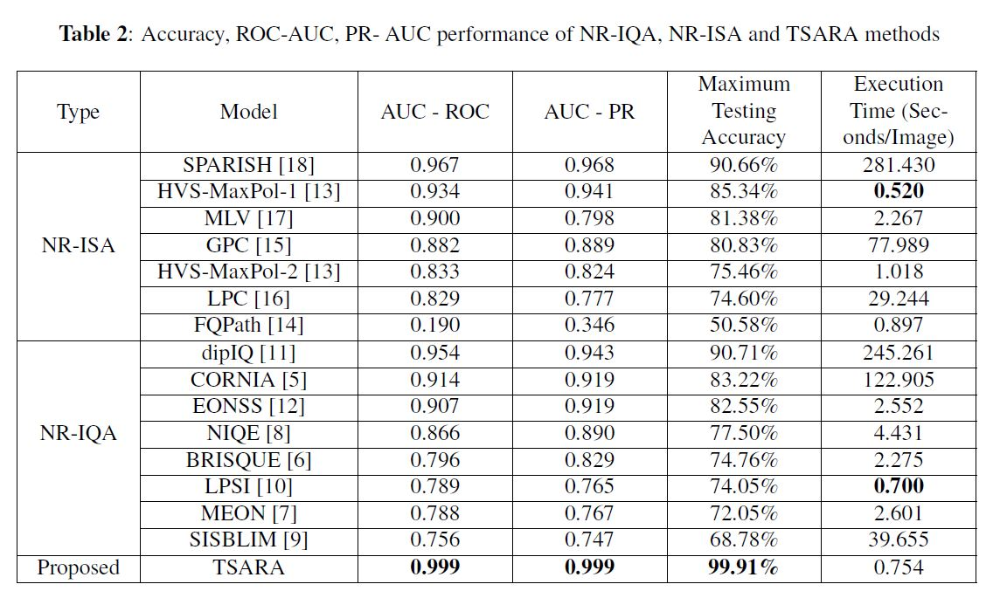
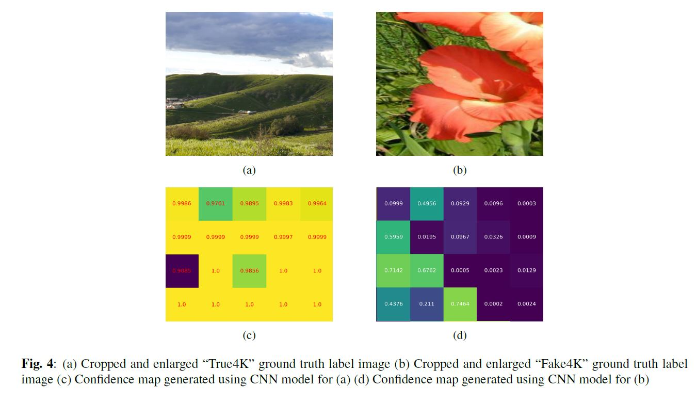

## TSARA
 This is the official **PyTorch** implementations of our **ICASSP 2021** paper "Real Versus Fake 4K - Authentic Resolution Assessment"
 
 
- [1. Brief Introduction](#1-brief-introduction)
  * [1.1 Backgrounds](#11-backgrounds)
  * [1.2 Contributions](#12-contributions)
  * [1.3 Results](#13-results)
  * [1.4 Citation](#14-citation)
- [2. Dataset](#2-dataset)
- [3. Prerequest](#3-prerequest)
  * [3.1 Environment](#31-environment)
  * [3.2 Packages](#32-packages)
  * [3.3 Pretrained Models](#33-pretrained-models)
- [4. Running the code](#4-running-the-code)
  * [4.1 Python Demo for testing a single image](#41-python-demo-for-testing-a-single-image-heatmap-available)
- [5. Codes for comparing models](#5-codes-for-comparing-models)
- [6. License](#6-license)

### 1. Brief Introduction

#### 1.1 Backgrounds

- In recent times, streaming **4K/UHD** or even higher resolution image/video content has been increasing steadily because of the potential to deliver crisp and detail rich **quality-of-experience (QoE)** to end-users.
- In practice, however, the pipeline of video acquisition, production, postproduction, and delivery often involves stages where video frames are scaled down to lower resolutions, and then upscaled back to 4K/UHD resolution at later stages. As a result, the authentic 4K resolution has been lost in the process while end-users are often poorly informed of such quality degradations. Therefore, we need True/Fake 4K decision in practical applications to ensure detail rich quality-of-experience (QoE).

#### 1.2 Contributions

- We introduced one of the first, the largest, and the only **public dataset** for real vs fake 4K image detection, which contains 10,824 True and Fake4K images. 
- We proposed highly efficient DNN based **TSARA (Two Stage Authentic Resolution Assessment)** algorithm that can classify the image based on its native resolution in real time.
  * First stage of algorithm - A CNN model is used to predict the class labels of the local patches.
  * Second stage of algorithm - Patch level label predictions are aggregated and a logistic regression on detection frequency is used to make an overall assessment of the whole image or video frame.
  
#### 1.3 Results

- Evaluation results on the proposed dataset
  

- Confidence map using local patch level prediction
  

#### 1.4 Citation

### 2. Dataset

   #### Will be published soon...

### 3. Prerequest

#### 3.1 Environment

The code has been tested on `Ubuntu 18.04` with `Python 3.8` and `cuda 10.2`

#### 3.2 Packages

`pytorch=1.3`, `torchvision=0.4`, `scikit-learn`, `pandas`, `pillow` (or `pillow-simd`)

#### 3.3 Pretrained Models

  - Pretrained model could be found in folder `pretrained_model/`

### 4. Running the code

- This section only shows basic usages, please refer to the code for more options.

#### 4.1 Python Demo for testing a single image

- Please make sure to open python file and mention correct image name and local image path in variable.

`python demo.py `

- The output should be 'True4K' for given input image.

### 5. Codes for comparing models

For other model compared in the paper, you can find the code in

1. FQPath: https://github.com/mahdihosseini/FQPath
2. HVS-MaxPol: https://github.com/mahdihosseini/HVS-MaxPol
3. Synthetic-MaxPol: https://github.com/mahdihosseini/Synthetic-MaxPol
4. LPC-SI: https://ece.uwaterloo.ca/~z70wang/research/lpcsi/
5. GPC: http://helios.mi.parisdescartes.fr/~moisan/sharpness/
6. MLV: https://www.mathworks.com/matlabcentral/fileexchange/49991-maximum-local-variation-mlv-code-for-sharpness-assessment-of-images
7. SPARISH: https://www.mathworks.com/matlabcentral/fileexchange/55106-sparish
